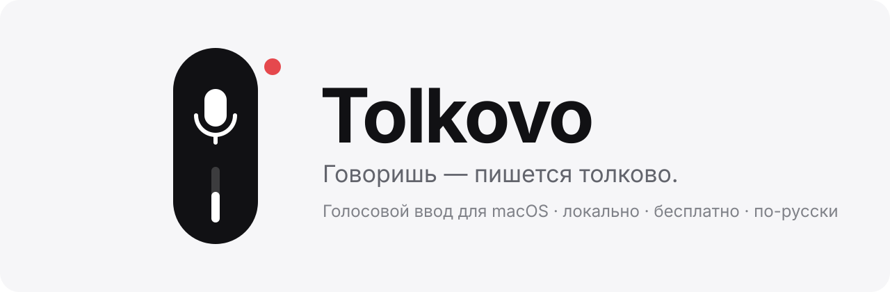

<p align="center">
  <picture>
    <source media="(prefers-color-scheme: dark)" srcset=".github/assets/banner-dark.svg">
    <source media="(prefers-color-scheme: light)" srcset=".github/assets/banner-light.svg">
    
  </picture>
</p>

<p align="center">
  <a href="https://github.com/kozliq/Tolkovo/releases/latest"></a>
  <a href="https://github.com/kozliq/Tolkovo/releases"></a>
  
  
  <a href="LICENSE"></a>
</p>

<p align="center">
  <a href="https://github.com/kozliq/Tolkovo/releases/latest"><b>Скачать</b></a> ·
  <a href="#как-это-работает">Как это работает</a> ·
  <a href="#приватность">Приватность</a> ·
  <a href="#вопросы">Вопросы</a> ·
  <a href="#english">English</a>
</p>

<br>

<!-- Сюда — GIF 10–15 секунд: хоткей → красная пилюля → говоришь → текст появляется в Telegram.
     Записать: Cmd+Shift+5 → «Записать выбранную область», потом сконвертировать в GIF через gifski.
<p align="center"></p>
-->

Нажал хоткей. Сказал. Текст уже стоит там, где был курсор — в Telegram, в браузере, в Notion, в терминале, где угодно.

Tolkovo распознаёт речь **прямо на твоём Mac**, без интернета и без подписок. По умолчанию работает на **GigaAM v3** — открытой модели, обученной именно на русской речи, поэтому понимает нас лучше универсальных англоязычных моделей.

## Установка

1. Скачай **[Tolkovo.dmg](https://github.com/kozliq/Tolkovo/releases/latest)** и перетащи значок в «Программы».
2. Запусти и выдай два разрешения: **микрофон** и **Универсальный доступ** — второе нужно, чтобы вставлять текст в чужие окна.
3. Дождись загрузки модели при первом запуске. Дальше — полностью офлайн.

<details>
<summary>macOS говорит, что приложение «повреждено» или «от неустановленного разработчика»</summary>
<br>

Сборка пока не нотаризована Apple — это стоит $99 в год, и мы до этого ещё дорастём. Лечится одной командой в Терминале:

```bash
xattr -dr com.apple.quarantine /Applications/Tolkovo.app
```

Это снимает с файла пометку «скачано из интернета». Сам код открыт — каждую строчку можно прочитать в этом репозитории.
</details>

## Как это работает

| | |
|---|---|
| **Горячая клавиша** | Назначаешь при первом запуске. Два режима: зажал — говоришь — отпустил, или нажал для старта и ещё раз для стопа |
| **Индикатор** | Маленькая плавающая пилюля: чёрная — ждёт, красная — слушает |
| **Распознавание** | GigaAM v3 для русского, Whisper и Parakeet для остальных языков |
| **Вставка** | Текст вставляется в активное поле, буфер обмена после этого восстанавливается |

## Приватность

Звук обрабатывается в памяти и никуда не уходит. Никакой телеметрии, аккаунтов, рекламы и облака. Единственное обращение в сеть — однократная загрузка модели распознавания.

Не верь на слово — проверь: код открыт, а каждый релиз собирается GitHub Actions прямо из этого репозитория с криптографическим подтверждением происхождения.

```bash
gh attestation verify Tolkovo.dmg --repo kozliq/Tolkovo
```

## Что дальше

- [x] Локальное распознавание русской речи на GigaAM v3
- [x] Работа в любом приложении
- [ ] Установка в один клик, русский интерфейс без единой настройки
- [ ] Новый индикатор-пилюля и минималистичный дизайн
- [ ] «Чистка» речи: убрать «ну», «короче», «эээ», поправить знаки препинания — тоже локально
- [ ] Страница проекта и статья на Хабре

Есть идея или нашёл баг — [открой issue](https://github.com/kozliq/Tolkovo/issues/new/choose).

## Вопросы

<details>
<summary>Это бесплатно? Где подвох?</summary>
<br>
Бесплатно навсегда. Подвоха нет: программа работает на твоём компьютере, серверов у нас нет, поэтому и брать деньги не за что. Если хочется отблагодарить — есть <a href="DONATE.md">донаты</a>, но это полностью добровольно и ни на что не влияет.
</details>

<details>
<summary>Нужен ли интернет?</summary>
<br>
Только один раз — чтобы скачать модель. Потом можно хоть в самолёте.
</details>

<details>
<summary>На каких маках работает?</summary>
<br>
На любых с Apple Silicon (M1 и новее) и macOS 14 или свежее.
</details>

<details>
<summary>А Windows?</summary>
<br>
Ядро кроссплатформенное, так что технически это возможно. Сейчас фокус — сделать идеальную версию для Mac.
</details>

## Поддержать

Если Tolkovo экономит тебе время — [угости кофе](DONATE.md). А ещё больше помогает ⭐ этому репозиторию и рассказ друзьям.

## Благодарности

Tolkovo — форк **[Handy](https://github.com/cjpais/Handy)** от CJ Pais. Всё ядро — запись, распознавание, вставка текста — сделано ими, и без их открытого кода этого проекта бы не было. Если тебе нужна англоязычная, кроссплатформенная версия — иди к ним.

Также спасибо командам **GigaAM** (SberDevices) за открытую русскую модель, **whisper.cpp** и **Tauri**.

## Лицензия

[MIT](LICENSE). Копирайт оригинального Handy сохранён, как того требует лицензия.

---

<a name="english"></a>
<details>
<summary><b>English</b></summary>
<br>

**Tolkovo** is a free, offline, privacy-first voice typing app for macOS, tuned for Russian speakers. Press a hotkey, speak, and the text appears wherever your cursor is. Runs GigaAM v3 locally for Russian, with Whisper and Parakeet for other languages. No cloud, no telemetry, no accounts.

It's a fork of the excellent [Handy](https://github.com/cjpais/Handy) — if you want the original cross-platform, English-first experience, go there.
</details>

<p align="center">
  <a href="https://www.star-history.com/#kozliq/Tolkovo&Date">
    <picture>
      <source media="(prefers-color-scheme: dark)" srcset="https://api.star-history.com/svg?repos=kozliq/Tolkovo&type=Date&theme=dark">
      
    </picture>
  </a>
</p>
